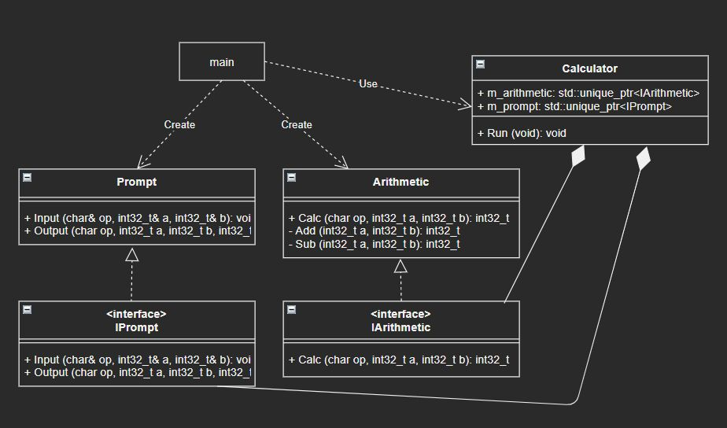
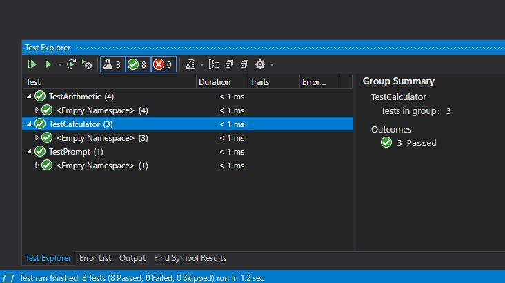

# Sample project for GoogleTest
- Create a simple calculator with GoogleTest

## Class Diagram
### For product
- To test core logic and input/output, make `Arithmetic` and `Prompt` module, respectively
- `Calculator` module contain these modules
- However, `Calculator` doesn't create these modules. Instead, use dependency injection
    - It's better to create a factory module, but in this project main function creates these modules to make it easy
- So that, I can use mock modules when running unit test for `Calculator` module



### For calculator unit test


## Structure
- main.cpp
- calculator/
- arithmetic/
- prompt/
- test/
    - calculator/
    - arithmetic/
    - prompt/

## How to
### Linux
```sh
mkdir -p build && cd build
cmake ..
make
ctest
./main
`>+ 1 2`
```

### Visual Studio
- Create Visual Studio project using cmake-gui
- Build the project
- Normal execution
    - Set `main` as a startup project
    - Run
    - `>+ 1 2`
- Test
    - Open Test Explorer
    - Run All Tests


